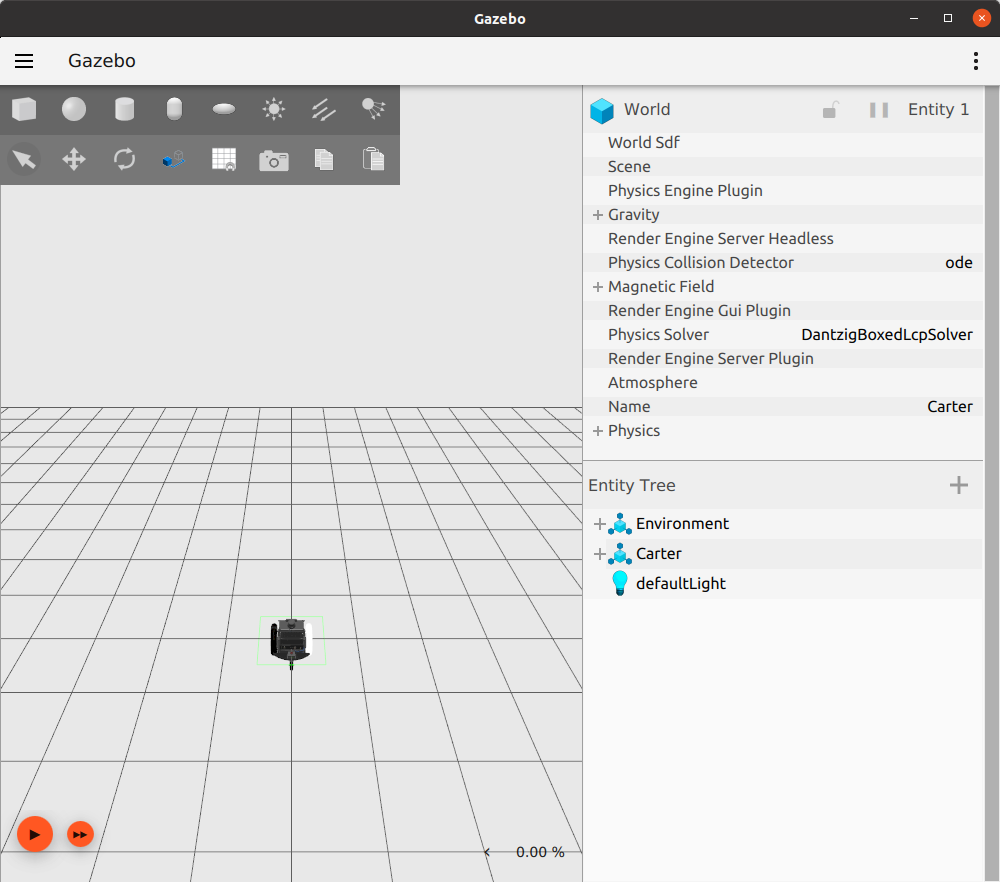

# Manipulating a diff drive vehicle from USD to SDF

This example will show how to export a USD diff drive model to SDF.
We are going to use the `Carter` model provided in the NVIDIA assets.

Remember to read first the [USD get started tutorial](./usdgetstarted.md).

## Requeriments

  - [ROS 2 Foxy](https://docs.ros.org/en/foxy/Installation.html)
  - [Ignition Gazebo](https://ignitionrobotics.org/docs/fortress)

## Tutorial

Run the converter (you must build sdformat first):

```bash
sdfconverter -i <path to assets>/isaac-sim-assets-2021.1.1/Samples/ROS/Robots/Carter_ROS.usd -o carter.sdf
```

Open [Ignition Gazebo](https://ignitionrobotics.org/docs/fortress) and load the `carter.sdf` file.

```bash
ign gazebo -v 4 -r carter.sdf
```



Now we can move the robot:

```bash
ign topic -t "/model/Carter/cmd_vel" -m ignition.msgs.Twist -p "linear: {x: 0.5}, angular: {z: 0.05}"
```

## ROS

Now we are going to use ROS 2 to move the robot. For this we should run a bridge between
Ignition Gazebo and ROS 2:

```bash
ros2 run ros_ign_bridge parameter_bridge /model/Carter/cmd_vel@geometry_msgs/msg/Twist@ignition.msgs.Twist
```

Now the bridge is actived and we can publish a ROS 2 message to move the diff drive base:

```bash
ros2 topic pub /model/Carter/cmd_vel geometry_msgs/msg/Twist '{linear: {x: 0.15, y: 0, z: 0}, angular: {x: 0, y: 0,z: 0}}' -1
```
